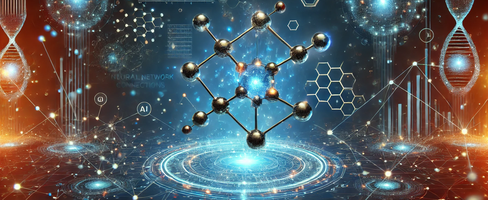

> _This repository contains Digital Alchemy Project (WiSo24/25 at FAU) and uses [QM7-X dataset](https://zenodo.org/records/4288677)._

## Project Title: **"_QuantumML-MolDynamics_"** Predicting Molecular Energies and Forces for Advanced Molecular Dynamics Simulations



---

### **Overview**

This project trains a machine learning model using the **QM7-X dataset** to predict **molecular energies and forces**. The trained model is then used in **Molecular Dynamics (MD) simulations** to study atomic motion under various conditions.

---

### Prerequisites

-   **Conda**: Install [Miniconda](https://docs.conda.io/en/latest/miniconda.html) or [Anaconda](https://www.anaconda.com/products/distribution) if not already installed.

---

### Setup Instructions

### 1. Create a Conda Environment

A `environment.yml` file is provided to set up the required dependencies. Run the following command to create the Conda environment:

```bash
conda env create -f environment.yml
```

This will create a Conda environment named `alchemy-env` (or the name specified in the environment.yml file).

### 2. Activate the Conda Environment & Install Dependencies

Activate the environment using:

```bash
conda activate alchemy-env
pip install
```

### 3. Dataset Preparation

Once the environment is activated, run the `prepare-dataset.sh` script to automate the dataset preparation process:

```bash
cd data
./prepare-dataset.sh
```

This script will:

-   Run download.py to download and convert the dataset to an HDF5 file.
-   Run create-db.py to create a database (.db) file from the downloaded dataset.

---

### Script Details

-   `data/download.py`: Downloads the dataset and converts it to an HDF5 file.
-   `data/create-db.py`: Creates a database (.db) file from the HDF5 file.
-   `data/prepare-dataset.sh`: Automates the execution of `download.py` and `create-db.py`.

---

### Directory Structure

After running the scripts, the project directory will look like this:

```bash
digital-alchemy/
├── ckpts
│   └── best_model
├── data
│   ├── create-db.py
│   ├── download.py
│   ├── prepare-dataset.sh
│   └── QM7X_Dataset
│       ├── 1000.hdf5
│       ├── 2000.hdf5
│       ├── 3000.hdf5
│       ├── 4000.hdf5
│       ├── 5000.hdf5
│       ├── 6000.hdf5
│       ├── 7000.hdf5
│       ├── 8000.hdf5
│       └── QM7X.db
├── energy-vs-time.py
├── environment.yml
├── evaluate.py
├── lightning_logs
│   └── version_1
│       ├── checkpoints
│       │   └── epoch=83-step=5292.ckpt
│       ├── events.out.tfevents.1739748819.redStation.1030311.0
│       └── hparams.yaml
├── mlruns
│   ├── 0
│   │   └── meta.yaml
│   ├── 595388344762858645
│   └── models
├── paper-presentation
│   ├── BiM-Network.ipynb
│   ├── dataset-explore.ipynb
│   └── README.md
├── qm7x_ase_calculations
│   └── test_molecule.xyz
├── README.md
├── requirements.txt
├── simulate_md.py
├── simulation
│   └── trajectory.traj
├── split.npz
├── splitting.lock
└── train.py
```

---

### Training the Model

Train the model to predict **molecular energy and forces**:

```bash
python train.py
```

### Training Details:

-   Uses `SchNet (as base)` neural network.
-   Optimized using `AdamW optimizer`.
-   Loss function balances energy (MSE loss) and force predictions.
-   Logs training results in MLflow.

### Check Training Progress in MLflow

Start MLflow UI to monitor training results:

```bash
mlflow ui --host 0.0.0.0 --port 5000
```

Open `http://localhost:5000` in your browser to visualize metrics.

---

### Evaluating the Model

Once training is complete, evaluate the model on **unseen test molecules**:

```bash
python evaluate.py
```

### Outputs:

-   Actual vs. Predicted Energy & Forces

---

### Running Molecular Dynamics (MD) Simulations

Use the trained model to simulate **atomic motion over time** with MD Algorithm **(Verlet or Langevin)**:

```bash
python simulate_md.py
```

### Expected Behavior:

-   The system should start with a **high-energy structure** and relax into a stable state.
-   If using a **Langevin thermostat**, the system should exhibit **thermal fluctuations**.

### Debugging MD Issues:

If energy remains **constant instead of fluctuating**, try:

-   **Reducing timestep** (`0.5 fs` instead of `1 fs`).
-   **Increasing Langevin friction** (`0.1` instead of `0.02`).
-   **Printing force values**:
    ```python
    print("Forces at Step 100:", atoms.get_forces())
    ```
-   **Printing temperature**:
    ```python
    print("Temperature at Step 100:", atoms.get_temperature())
    ```

---

### Visualizing MD Results

-   **View Atomic Motion in ASE GUI**

    ```bash
    ase gui trajectory.traj
    ```

    This opens an interactive visualization of **how atoms move over time**.

-   **Plot Energy vs. Time**
    Run the following script to analyze energy stability:

    ```bash
    python energy-vs-time.py
    ```

    This will generate a plot showing **how total energy evolves over time**.

-   **Extract MD Energies from Trajectory**

    ```python
    from ase.io import Trajectory

    # Load MD trajectory
    traj = Trajectory("simulation/trajectory.traj")

    # Print energies at each step
    for step, atoms in enumerate(traj):
        print(f"Step {step}: Energy = {atoms.get_potential_energy()} eV")
    ```

---

### Troubleshooting

-   **Conda Environment Issues**: If the environment creation fails, ensure the environment.yml file is correct and try updating Conda:

```bash
conda update conda
```

-   **Permission Denied**: If `prepare-dataset.sh` fails to execute, make it executable:

```bash
chmod +x prepare-dataset.sh
```

-   **Missing Dependencies**: If any Python script fails, ensure all dependencies are installed by checking the environment.yml file.

---

### **References**

-   Christensen, A. S., Faber, F. A., Papajak, E., Huang, B., Tkatchenko, A., & von Lilienfeld, O. A. (2020). QM7-X, a comprehensive dataset of quantum-mechanical properties spanning the chemical space of small organic molecules. Scientific Data, 7(1), 1-7. https://doi.org/10.1038/s41597-020-0473-z

-   Schütt, K. T., Hessmann, S. S. P., Gebauer, N. W. A., Lederer, J., & Gastegger, M. (2023). SchNetPack 2.0: A neural network toolbox for atomistic machine learning. The Journal of Chemical Physics, 158(14), 144801. https://doi.org/10.1063/5.0138367

-   Schütt, K. T., Kessel, P., Gastegger, M., Nicoli, K., Tkatchenko, A., & Müller, K.-R. (2019). SchNetPack: A deep learning toolbox for atomistic systems. Journal of Chemical Theory and Computation, 15(1), 448-455. https://doi.org/10.1021/acs.jctc.8b00908
